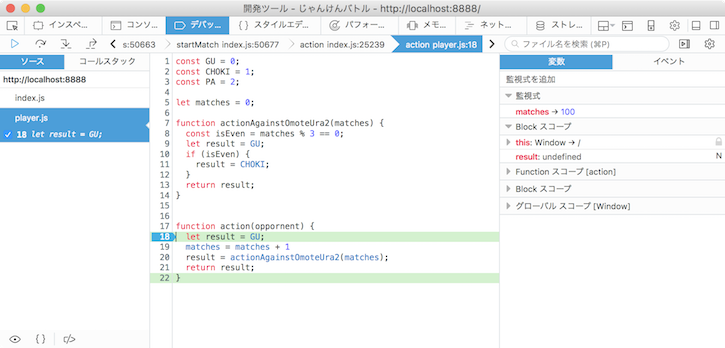

# 情報技術基礎 #05

N.Shimizu (chiko@tom.sfc.keio.ac.jp)

---

## 前回の内容

* 関数を定義する意味
* スコープ

---

## 練習問題1

* デバッガを起動します
* 「開発ツール」→「デバッガー」

---

## 練習問題2

* スコープの振る舞いを確認します
* 「監視式」に式を書くと評価値を確認できます

---

# 練習問題3

* 以下の処理を、それぞれ別の関数に実装してください
  * 「チョキ大好きマン」への処理
  * 「表か裏かマン」への処理
* ヒント：GitHubで過去の変更内容を確認できます

---

## 文字列

~~~javascript
let a = "Hello, world";
console.log(a);
~~~

* 文字列：0 個以上の文字のならび
  * ' と ' で挟まれたものは文字列となります
  * " と " で挟まれたものも文字列となります
* c.f. [String](https://developer.mozilla.org/ja/docs/Web/JavaScript/Reference/Global_Objects/String)

----

### 文字列と文字列の比較

 |演算子|意味|使用例|`a = "abcd"`の時の評価値|
|----|----|----|-----|
|`==`|等しい|`a == "defg"`|`false`|
|`!=`|等しくない|`a != "defg"`|`true`|
|`>`|より大きい|`a > "defg"`|`false`|
|`<`|より小さい|`a < "defg"`|`true`|
|`>=`|以上|`a >= "defg"`|`false`|
|`<=`|以下|`a <= "defg"`|`true`|

* 順序の比較は辞書式に行われます
* 日本語との比較には注意が必要です

----

### 数値と文字列との比較

~~~javascript
let str = "10"
let num = 10;
console.log(str == num); // true
console.log(str === num); // false
~~~

* `10`と`"10"`は違う値です
* `==`演算はデータを暗黙的に変換して比較してしまうため、`10 == "10"`の評価値は `true` となります
* 厳密に区別する場合は`===`演算子を利用します

---

## 練習問題4

* `action`関数の第1引数は対戦相手の名前です
* これを利用して`action`関数を変更してください
   * 変更内容：相手に応じた戦略の選択
   * 相手に合わせて呼ぶ関数を選びます
* 動作を確認したら、変更をコミットしてください

---

## マージ（merge）

* 他のブランチの変更を反映する作業です
* 手順：
  * 作業ブランチを、マージ先のものに変更します
  * メニューのranch"から、"merge into"を選びます
  * プルダウンから、マージ元のブランチを選びます
  * "merge"ボタンを押します

---

## 練習問題5

* マージを行なってください
  * マージ元："lecture04"ブランチ
  * マージ先："master"ブランチ
* その変更をpull requestとして送ってください

---

## 練習問題6

* "sffcjs/master"の更新を反映してください
* 手順
  * 作業ブランチを"master"ブランチへ戻します
  * "Sync"ボタンを押します
  * "update from sfcjs/master"ボタンを押します

---

## 練習問題7

* "lecture05"というブランチを作ってください

---

## 練習問題8

* 順番に出してゆくマン勝ってください
* 勝ったら、変更をコミットしてください

---

## 配列：値を並べたリスト

~~~javascript
function action(oppornent){
  cost list = cards();
  console.log(list);
  return 1;
}
~~~

* `card`関数を呼ぶと、相手の手の履歴を取得できます
* 履歴は配列に格納されています

---

## 配列の長さ：要素の数

~~~javascript
function action(oppornent){
  cost list = cards();
  console.log(list);
  console.log(list.length);
  return 1;
}
~~~

* 要素：配列に保存されている値
* `{配列名}.length`
* 属性：配列自体に関する情報

---

## 練習問題9

* `matches`を使わなくても試合数がわかります
* ヒント：
   * `cards`：これまで相手が出した手
   * 配列の長さ  
* 動作を確認して、変更をコミットしてください

---

## 配列の要素の参照

~~~javascript
function action(oppornent){
  const list = cards();
  const index = Math.max(0, list.length - 1);
  const lastCard = list[index];
  console.log(lastCard);
  return 1;
}
~~~

* 添え字を使って各要素にアクセスします
* 添え字は`[]`の中に数字を書いて指定します
* 添え字は0からスタートします

---

## 練習問題10

* 帰ってきた順番に出すマンに勝ってください

---

## 練習問題11

* `lecture05`を`master`へマージしてください
* マージしたらpull requestを送ってください
